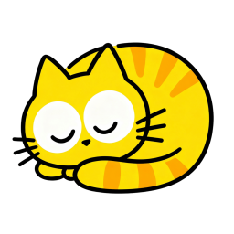

# 【眯一会儿】你的萌系桌面休息教练！

长时间盯电脑眼睛痛死啦，让治愈系动画提醒你该休息啦！自定义工作、休息时间，搭配软萌动态画面， break time 变成期待时刻。还能上传爱宠照片，提醒时心都化了！

用可爱的方式保护眼睛和效率，立即开启你的健康节奏吧！

## 下载与市场

-   App Store：即将上线

## 主要功能

-   状态栏计时：清晰显示剩余时间；临近休息前支持低干扰闪烁提示
-   全屏休息：覆盖多显示器，沉浸式休息页，一键继续或（可选）跳过
-   时长可调：工作与休息时长自由设置（分钟/秒），更贴合你的节奏
-   个性化内容：导入/选择休息与工作图片，支持随机轮换；自定义提示文案与随机列表
-   声音提醒：开始休息与结束休息可分别开启/关闭音效
-   贴心细节：支持开机自启、显示/隐藏菜单栏计时、明/暗/跟随系统三种外观
-   本地化：简体中文 / English 可切换

## 适合人群

-   长时间办公、编码、设计与学习的用户
-   需要规律短休以保持效率与专注的人

## 使用建议

先从自己熟悉的工作时长开始，逐步微调；结合随机图片与文案，给每次休息一点新鲜感。

## 订阅与购买

-   提供 7 天免费试用。试用期结束后可通过订阅或买断继续使用全部功能。
-   订阅会自动续订，除非在当前周期结束前 24 小时于账户设置中关闭自动续订。
-   购买将记入你的 Apple ID。你可在“账户设置”管理或取消订阅。
-   隐私与条款链接请见下方支持链接。

## 温馨提示

眯一会儿 旨在帮助你定时休息与放松，不提供医疗建议。

## 支持与政策

-   用户协议：[《用户协议》](./terms-of-service)
-   隐私政策：[《隐私政策》](./privacy-policy)
