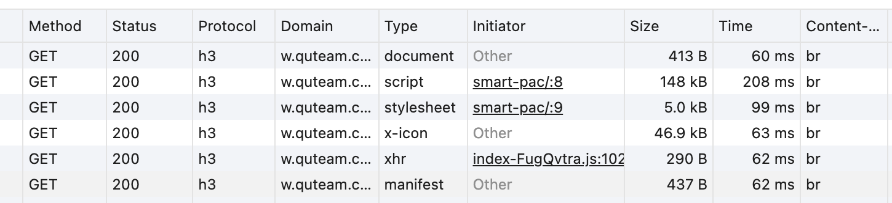

# Nginx Brotli 模块配置

Nginx 更新到了 1.26 稳定版，主要增加 HTTP/3 功能的支持。
我的多台服务器一般都是使用包管理器安装软件，省去需要更新时编译安装的麻烦（编译安装也有很多好处，根据具体场景选择），自然 nginx 也是一键更新。然而最新版的 Debian/Ubuntu 系统 nginx 版本还在 1.22，`libnginx-mod-http-brotli-filter` 版本需要依赖 1.22，不能直接用 brotli 模块。下面提供几种在最新版 nginx 中集成 brotli 的解决方案。

## 1. 使用源码编译安装

网上绝大多数教程都是这种方式，具体操作移步 https://github.com/google/ngx_brotli

## 2. 适配当前版本的脚本安装

一键脚本编译

```bash
/bin/bash -c "$(curl -fsSL https://site.quteam.com/download/quic-brotli/build-nginx-brotli-modules.sh)"
```

脚本自动运行，并编译两个模块文件:

-   `ngx_http_brotli_filter_module.so`
-   `ngx_http_brotli_static_module.so`

::: tip 备注
如果不想自己编译，这里提供编译好的文件，可以直接下载使用。

-   x86_64
    -   [ngx_http_brotli_filter_module.so](https://site.quteam.com/download/quic-brotli/x86_64/ngx_http_brotli_filter_module.so)
    -   [ngx_http_brotli_static_module.so](https://site.quteam.com/download/quic-brotli/x86_64/ngx_http_brotli_static_module.so)
-   arm64
    -   [ngx_http_brotli_filter_module.so](https://site.quteam.com/download/quic-brotli/arm64/ngx_http_brotli_filter_module.so)
    -   [ngx_http_brotli_static_module.so](https://site.quteam.com/download/quic-brotli/arm64/ngx_http_brotli_static_module.so)

:::

复制文件到 nginx 模块目录`/usr/lib/nginx/modules`

```bash
mv ngx_http_brotli_* /usr/lib/nginx/modules
```

修改 nginx 配置文件`/etc/nginx/nginx.conf`，文件顶部添加

```nginx
load_module modules/ngx_http_brotli_filter_module.so;
load_module modules/ngx_http_brotli_static_module.so;
```

在配置文件`/etc/nginx/nginx.conf` 的 `http` 段添加

```nginx
brotli on;
brotli_comp_level 6;
brotli_static on;
brotli_types application/atom+xml application/javascript application/json application/rss+xml
    application/vnd.ms-fontobject application/x-font-opentype application/x-font-truetype
    application/x-font-ttf application/x-javascript application/xhtml+xml application/xml
    font/eot font/opentype font/otf font/truetype image/svg+xml image/vnd.microsoft.icon
    image/x-icon image/x-win-bitmap text/css text/javascript text/plain text/xml;
```

重启 nginx 服务

```bash
nginx -t
nginx -s reload
# systemctl restart nginx
```

## 3. 效果



## 4. 其他事项

如果 nginx 使用的是 proxy_pass 反向代理，代理服务有自己的压缩方式时，需要在 `location` 去掉编码，否则会导致后端服务的压缩方式直接返回给浏览器。

```nginx
location / {
    # ...
    proxy_set_header Accept-Encoding "";
    # ...
}
```
