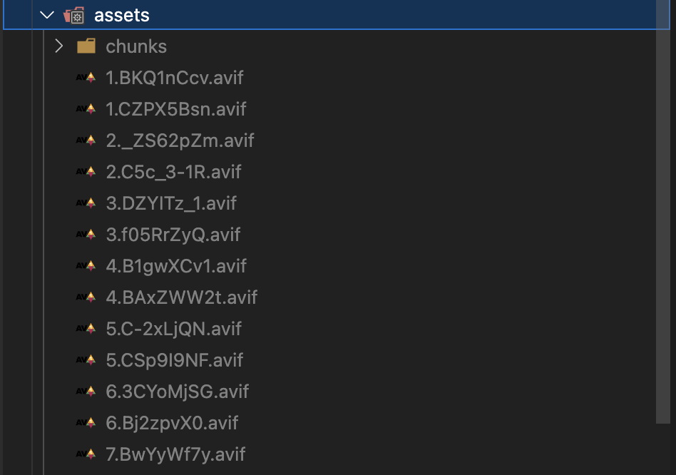

# Vite/Vitepress 图片优化最佳实践

在现代前端开发中，图片资源优化对网站性能有着重要影响。本文将介绍如何在 Vite 项目中配置自动生成 AVIF 和 WebP 格式的图片。

## 安装依赖

首先需要安装必要的依赖：

```bash
npm install vite-imagetools -D
```

## 配置 Vite

在 `vite.config.ts` 中添加以下配置：

```typescript
import imagetools from 'vite-imagetools';

export default defineConfig({
    plugins: [
        imagetools({
            // 配置全部图片的默认处理
            defaultDirectives: new URLSearchParams({
                format: 'webp;avif;jpg',
                quality: '80',
                w: '800',
            }),
        }),
    ],
});
```

## 配置 Vitepress

在 `.vitepress/config.ts` 中添加以下配置：

```typescript
import { defineConfig } from 'vitepress';
import imagetools from 'vite-imagetools';

export default defineConfig({
    vite: {
        plugins: [
            imagetools({
                defaultDirectives: new URLSearchParams({
                    format: 'webp;avif;jpg',
                    quality: '80',
                    w: '800',
                }),
            }),
        ],
    },
});
```

## 使用示例

在你的组件中，可以这样使用：

```tsx
import myImage from './assets/example.jpg?format=webp;avif;jpg&w=800&q=80';

function MyComponent() {
    return (
        <picture>
            <source srcSet={myImage.avif} type='image/avif' />
            <source srcSet={myImage.webp} type='image/webp' />
            
        </picture>
    );
}
```

## 构建时生成图片



## 注意事项

1. AVIF 格式目前并非所有浏览器都支持，需要做好降级处理
2. 建议根据实际项目需求调整压缩质量参数
3. 可以使用浏览器开发者工具的 Network 面板查看实际加载情况

## 总结

通过配置 vite-imagetools，我们可以：

-   自动生成优化后的图片格式
-   显著减少图片体积
-   提升网站加载性能
-   保持良好的图片质量

记得在实际项目中根据具体需求调整配置参数，找到文件大小和图片质量的最佳平衡点。
