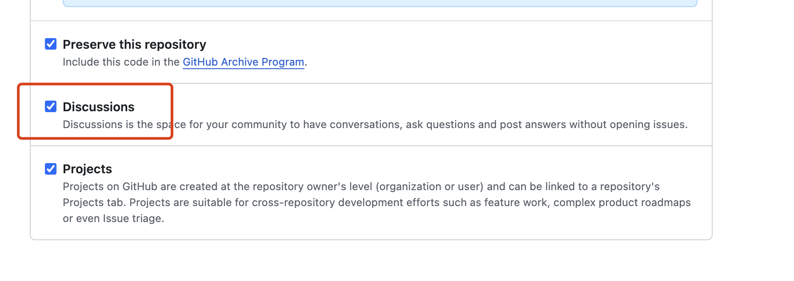
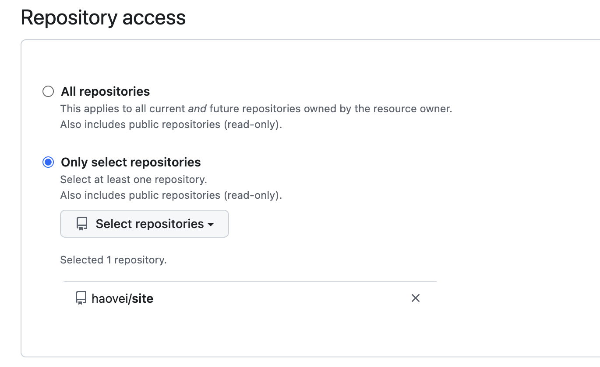
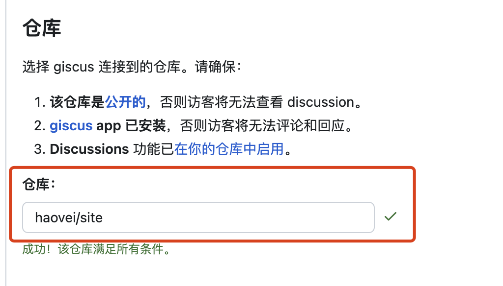
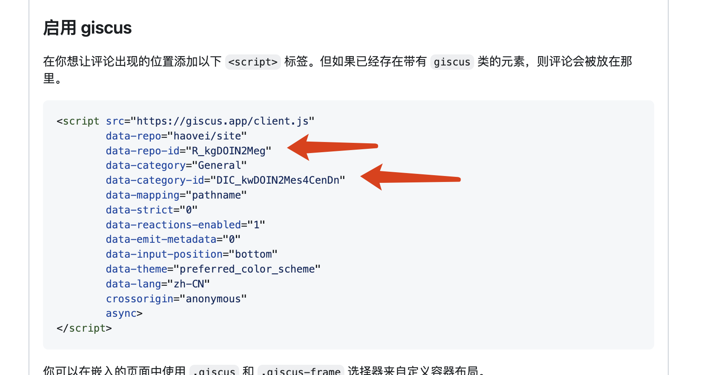
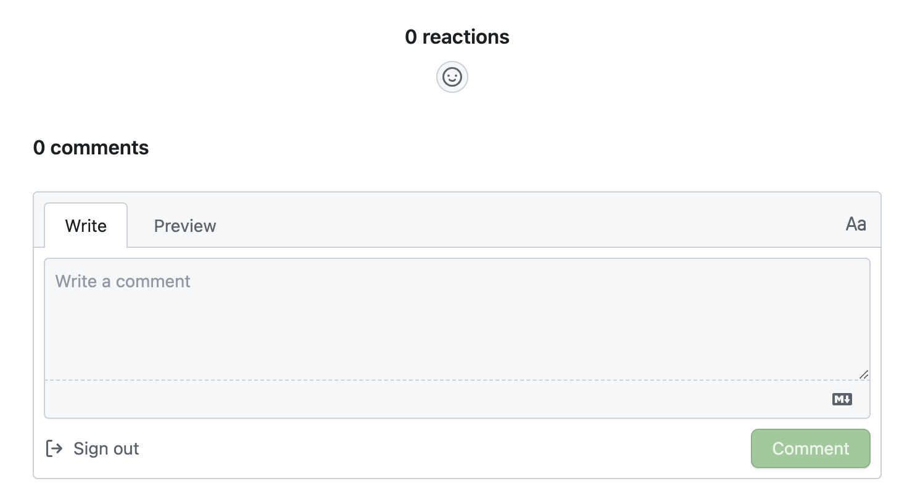

# 给 VitePress 添加评论功能

VitePress 在生产静态站点时，快速且功能很强大，但作为静态站点，没有评论功能。网上有很多无后端评论系统，比如 Gitalk、Utterances 等，这些评论系统都是基于 GitHub Issue。Issue 本意是用来记录错误问题的，作为评论存储有点不妥。Giscus 受 Utterances 启发，利用 GitHub Discussions 实现的评论存储，更符合评论的本意。

本文就介绍下用 [Giscus](https://giscus.app/) 为 VitePress 添加评论功能。

## 一. Giscus 特点

-   开源。🌏
-   无跟踪，无广告，永久免费。📡 🚫
-   无需数据库。所有数据均储存在 GitHub Discussions 中。:octocat:
-   支持自定义主题！🌗
-   支持多种语言。🌐
-   高可配置性。🔧
-   自动从 GitHub 拉取新评论与编辑。🔃
-   可自建服务！🤳

## 二. 使用 Giscus

### 2.1 开启仓库的 Github Discussions

在仓库的 `Settings` -> `General` -> `Features` -> `Discussions` 中开启 Discussions 功能


### 2.2 Github 仓库安装 Giscus app

按照 GitHub OAuth 流程授权 [giscus app](https://github.com/apps/giscus)，授权需要评论的仓库


### 2.3 获取 Giscus 配置

打开 [Giscus](https://giscus.app/)，输入仓库名，获取配置信息



选择 Discussions 分类


自动获得到配置文件，主要是需要获得 `repo-id` `category-id`



## 三. VitePress 配置

### 3.1 加 Giscus 配置组件

在 `.vitepress/theme/components` 目录下新建 `GiscusComment.vue` 文件，内容如下：

```vue
<template>
    <div style="margin-top: 24px">
        <Giscus
            id="comments"
            repo="haovei/site"
            repoid="R_kgDOIN2Meg"
            category="General"
            categoryid="DIC_kwDOIN2Mes4CenDn"
            mapping="pathname"
            term="Welcome to giscus!"
            reactionsenabled="1"
            emitmetadata="0"
            inputposition="top"
            loading="lazy"
            :theme="isDark ? 'dark' : 'light'"
            :key="route.path"
        ></Giscus>
    </div>
</template>

<script setup>
import Giscus from '@giscus/vue';
import { useRoute, useData } from 'vitepress';

const route = useRoute();
const { isDark } = useData();
</script>
```

-   `:key="route.path"` 用于刷新评论组件，保证每个页面都有独立的评论。
-   `:theme` 用于根据页面主题切换评论主题。

### 3.2 引入 GiscusComment 组件

在 `.vitepress/index.ts` 中引入 GiscusComment 组件

```js
import { h } from 'vue';
import Theme from 'vitepress/theme';
import GiscusComment from './components/GiscusComment.vue';

export default {
    ...Theme,
    Layout() {
        return h(Theme.Layout, null, {
            'doc-after': () => h(GiscusComment),
        });
    },
};
```

`VitePress` 很好的一个地方是有很多 `Slot`, `doc-after` 就是一个 `Slot`，用于在文档内容后插入内容。

## 四. 完成 🎉

配置完就可以在 VitePress 文档中看到评论功能了。如下显示：


