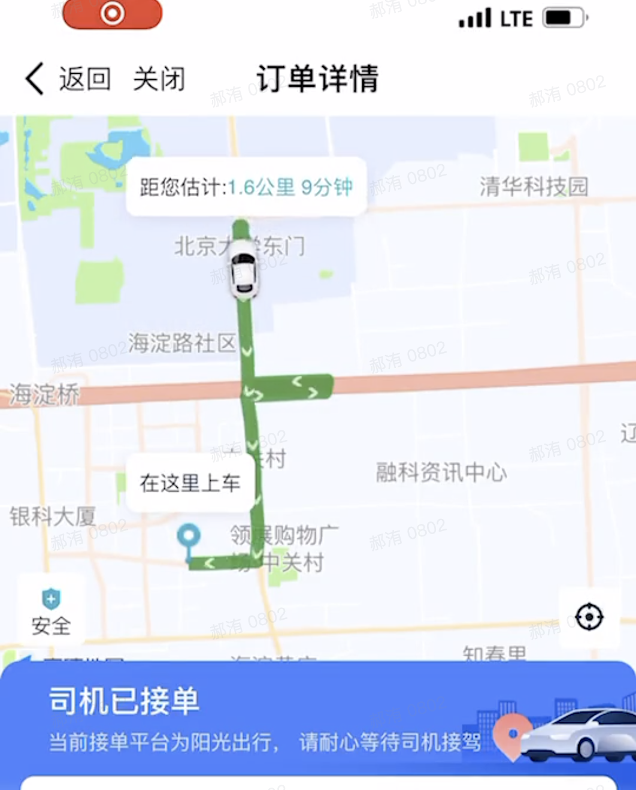
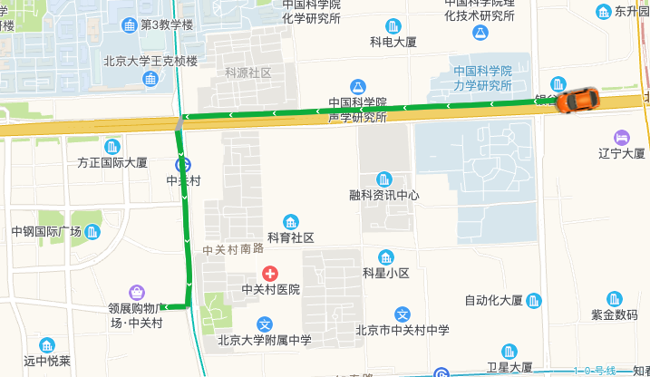
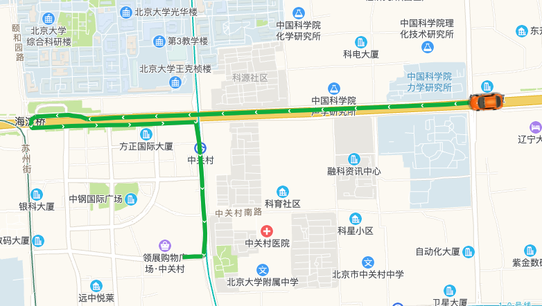
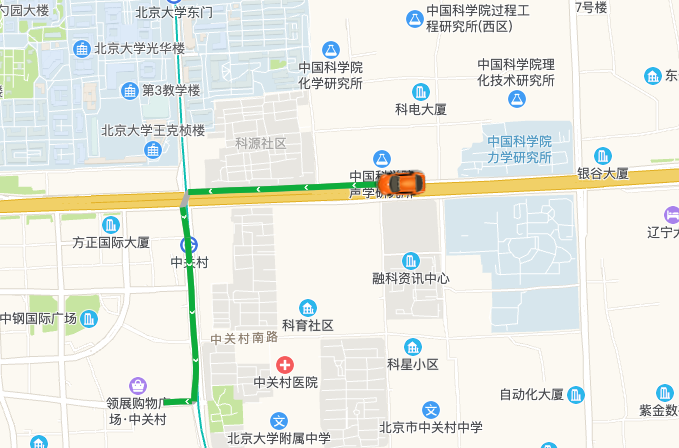
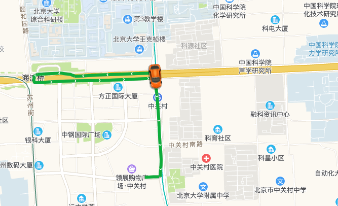
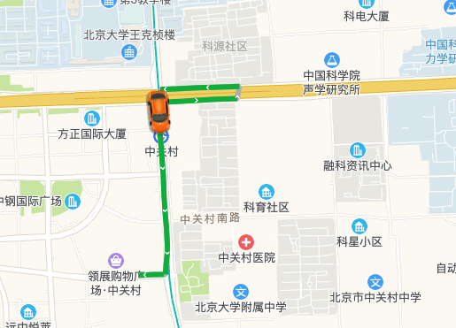
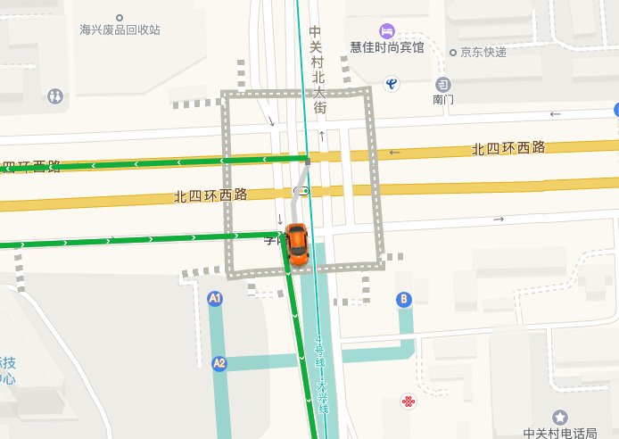
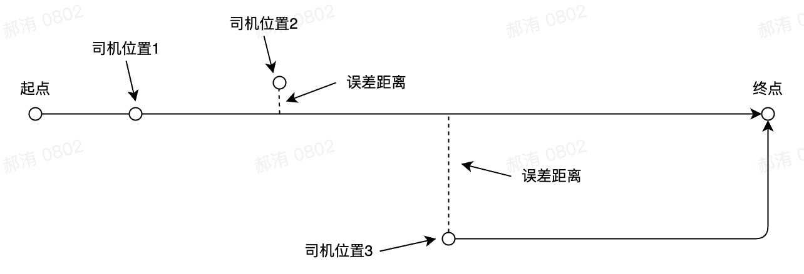
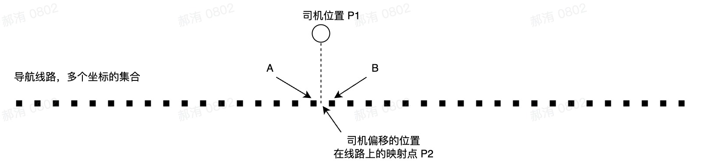

# 用车导航线路乱窜问题解决

## 一、问题

司机接单后，导航线路到处乱窜



## 二、原因分析

线路逻辑：通过轮询请求司机实时位置，通过 `driving.search` 实时获取线路，再绘制到地图上

路线流程截图

|  |  |  |  |  |
| :--------------------------------------: | :--------------------------------------: | :--------------------------------------: | :--------------------------------------: | :--------------------------------------: |

当司机在四字路口时，`driving.search` 并不知道此时司机在哪条路，往那个方向，桥上还是桥下



获取的线路就会变化，表现出来就是线路乱窜。同样情况，还会出现主道、辅道的差别

## 三、解决方案

**思路**：不使用实时获取线路，采用初始位置路线



线路绘制规则：

1. 司机接单时获取整个线路坐标点集合
2. 司机新位置比对线路距离
   1. 新位置在线路附近，继续使用线路（司机位置 1、司机位置 2）
   2. 误差距离超过一定值（暂 100m），重新获取线路（司机位置 3）

**如何判断司机是否在线路上？**



1. 判断 P1 是否在线路上（`isPointOnLine`），如果不在，重新获取线路
2. 找到线路上离 P1 最近的点 P2（映射点）`closestOnLine`
3. 遍历线路坐标集合，找到离 P2 最近的点 A
4. 切割线路集合，`moveAlong` B 点后的点

## 四、相关代码

```js
// 计划线路
async function autoDriving(poi) {
  return new Promise((resolve, reject) => {
    driving.search(
      new AMap.LngLat(poi[0], poi[1]),
      new AMap.LngLat(116.315363, 39.978805),
      function (status, result) {
        if (status === 'complete') {
          console.log('绘制驾车路线完成');
          console.log(result);
          const _arr = [];
          result.routes[0].steps.forEach((step) => {
            _arr.push(...step.path);
          });
          resolve(_arr);
        } else {
          console.error('获取驾车数据失败：' + result);
          reject();
        }
      }
    );
  });
}

// 找到最近的点
function findClosestPoi(poi, poiArr) {
  let closestPoi = poiArr[0];
  let closestDistance = 100;
  for (let i = 1, l = poiArr.length; i < l; i++) {
    const distance = AMap.GeometryUtil.distance(poi, poiArr[i]);
    if (distance < closestDistance) {
      closestDistance = distance;
      closestPoi = poiArr[i];
    }
  }
  return closestPoi;
}

// 司机位置集合
const lineArr = [
  [116.336245, 39.986401],
  [116.335185, 39.986326],
  [116.334312, 39.986206],
  [116.333981, 39.986187],
  [116.333956, 39.986325],
  [116.332157, 39.986232],
  [116.328713, 39.986112],
  [116.327339, 39.986066],
  [116.325604, 39.98601],
  [116.323295, 39.985939],
  [116.321559, 39.985876],
  [116.319333, 39.985811],
  [116.316617, 39.985725],
  [116.316329, 39.985542],
  [116.316329, 39.985541],
  [116.316328, 39.98554],
  [116.31624, 39.985362],
  [116.316354, 39.984357],
  [116.316553, 39.982461],
  [116.316721, 39.980348],
  [116.31674, 39.979694],
  [116.316669, 39.978999],
  [116.315363, 39.978805],
];

// 获取导航路径
(async function getDrivingLine() {
  const drivingSearchArr = await autoDriving(lineArr[0]);
  polyline.setPath(drivingSearchArr);
  console.log('drivingSearchArr', drivingSearchArr);

  let lastIndex = 0;
  // 模拟获取司机位置
  for (let poi of lineArr) {
    await sleep(1000);
    // 司机位置是否在路线上
    if (AMap.GeometryUtil.isPointOnLine(poi, drivingSearchArr, 100)) {
      // 最近点坐标
      const closestPoiOnLine = AMap.GeometryUtil.closestOnLine(
        poi,
        drivingSearchArr.slice(lastIndex)
      );
      const closestPoi = findClosestPoi(closestPoiOnLine, drivingSearchArr);
      const index = drivingSearchArr.indexOf(closestPoi);
      if (lastIndex < index) {
        lastIndex = index;
        console.log(lastIndex, closestPoi);
        const lastArr = drivingSearchArr.slice(lastIndex);
        marker.moveAlong(lastArr, 200);
        polyline.setPath(lastArr);
      }
    } else {
      // TODO: 重新 driving.search 获取路线
      console.log('不在路线上，重新获取路线');
    }
  }
})();
```
