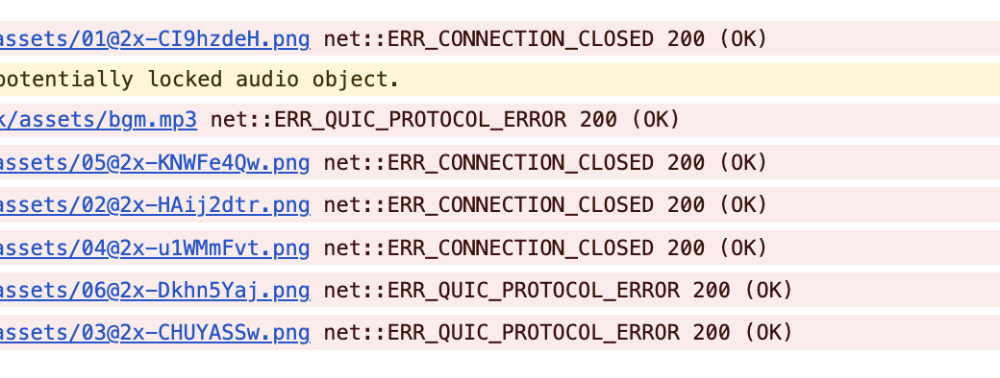
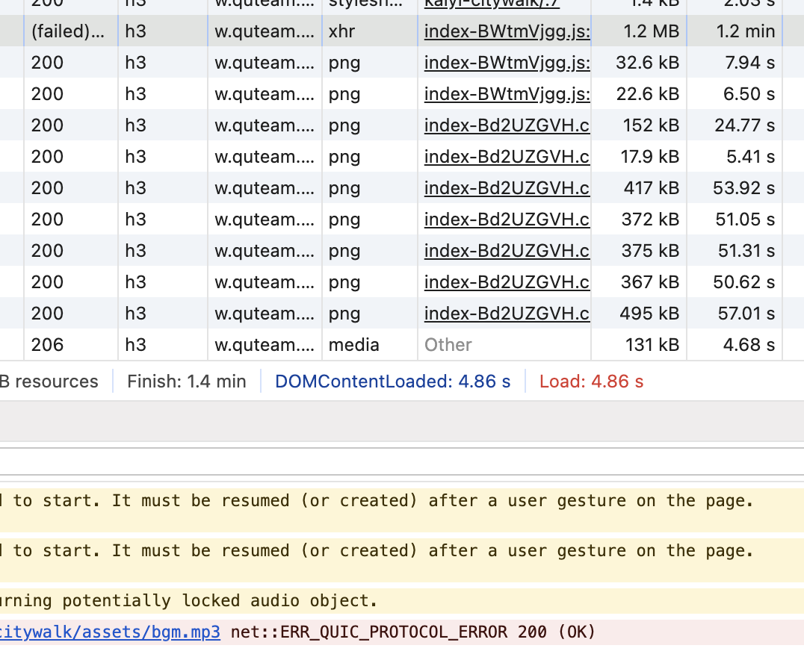
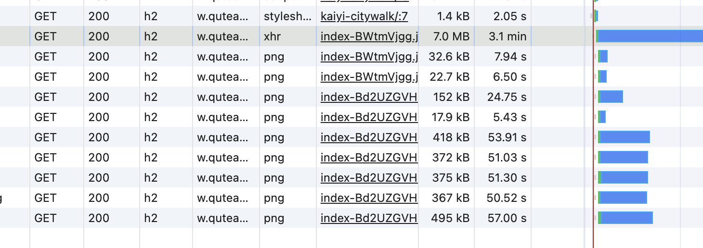

# HTTP/3 QUIC 网络错误

## 背景

nginx 1.26 稳定版正式发布，升级的主要功能是支持 HTTP/3，第一时间在服务器上升级了 nginx，开启了 HTTP/3。完美运行，效果很好。
这段时间远程办公，没有 wifi，全靠手机流量，刚好这两天月底，流量耗完，触发了电信的**达量限速**，带宽降到了 1Mbps 😅。

## 发现问题

这种低速网络网络情况下，测试了下自己服务器的 HTTP/3 的效果。
额～，出现大量的 `net::ERR_QUIC_PROTOCOL_ERROR`, `net::ERR_CONNECTION_CLOSED` 错误



这些错误大约在 20s 左右的时间统一出现，然后页面就无法访问了。

## 排查问题

根据现象，猜测两个主要原因：1、服务器配置问题，2、运营商网络问题

电信限速，就换个网络环境，用移动的网络测试了下


移动网络没有限速，在 Chrome 里手动限速为 `Slow 3G`，只有一个大文件在 1.2min 时报了 `net::ERR_QUIC_PROTOCOL_ERROR` 错误。

同一服务器，不同运营商网络表现差异明显。

切换会电信网络，`chrome://flags/#enable-quic` 关闭 QUIC，浏览器限速 `Slow 3G` 再测试：



关闭 QUIC，使用 HTTP/2 协议，没有出现错误，页面正常加载。即使 3.1min 的加载都能正常访问。排除无线网络的稳定性问题

看来主要原因是 HTTP/2 和 HTTP/3 的差异导致的问题，底层是 TCP 和 UDP 的差异，大概率是运营商会通过 QoS 策略限制 UDP 流量

::: tip 注意
关于有个文件在 1.2min 左右超时问题，在有线宽带下 `Slow 3G` 测试也同样出现，能稳定复现。 nginx 官方文档 `quic_timeout` 没设置时，默认取 `keepalive_timeout` 值，`keepalive_timeout` 的默认值是 75s，和 1.2min 这个时间点接近。但 nginx 1.26 版本没有了 `quic_timeout` 配置，通过修改 `keepalive_timeout` 时间也无效。怀疑这个问题是 nginx 的 QUIC 超时配置的 bug。
:::

## 验证问题

本地和服务器使用 `iperf3` 测试 UDP 的速度，结果如下：

UDP 限速测试：

```shell
# ...
[  5]  16.00-17.00  sec   127 KBytes  1.04 Mbits/sec  2.482 ms  0/100 (0%)
[  5]  17.00-18.00  sec   127 KBytes  1.04 Mbits/sec  1.734 ms  0/101 (0%)
[  5]  18.00-19.00  sec   124 KBytes  1.02 Mbits/sec  11.018 ms  0/98 (0%)
[  5]  19.00-20.00  sec   132 KBytes  1.08 Mbits/sec  1.882 ms  0/104 (0%)
[  5]  20.00-21.00  sec   127 KBytes  1.04 Mbits/sec  0.846 ms  0/100 (0%)
[  5]  21.00-22.00  sec   124 KBytes  1.02 Mbits/sec  0.917 ms  4/102 (3.9%)
[  5]  22.00-23.00  sec   121 KBytes   988 Kbits/sec  1.531 ms  6/101 (5.9%)
[  5]  23.00-24.00  sec   121 KBytes   988 Kbits/sec  1.201 ms  6/101 (5.9%)
[  5]  24.00-25.00  sec   119 KBytes   977 Kbits/sec  1.607 ms  6/100 (6%)
[  5]  25.00-26.00  sec   110 KBytes   905 Kbits/sec  0.319 ms  14/101 (14%)
[  5]  26.00-27.00  sec   116 KBytes   947 Kbits/sec  1.439 ms  10/101 (9.9%)
# ...
[ ID] Interval           Transfer     Bitrate         Jitter    Lost/Total Datagrams
[  5]   0.00-60.06  sec  7.18 MBytes  1.00 Mbits/sec  2.081 ms  255/6050 (4.2%)  receiver
```

有线带宽测试

```shell
[ ID] Interval           Transfer     Bitrate         Jitter    Lost/Total Datagrams
[  5]   0.00-60.00  sec  7.50 MBytes  1.05 Mbits/sec  0.000 ms  0/5602 (0%)  sender
[  5]   0.00-60.04  sec  7.50 MBytes  1.05 Mbits/sec  3.043 ms  0/5602 (0%)  receiver
```

结果可以看出 UDP 的速度在 1Mbps 左右，和电信限速的速度一致，在 20s 左右的时间点，UDP 流量开始被限制，出现 6% 左右的丢包率，与时间 Chrome 上的体验表现相同。在没有限速的情况下，UDP 流量没有丢包，QoS 没有介入。

## 结论

HTTP/3 在低速网络环境，尤其是被限速的环境下，可能会出现 `net::ERR_QUIC_PROTOCOL_ERROR` 错误，主要原因是运营商网络对 UDP 的限制。
在有网络限制或拥堵的情况下，QoS 策略优先保证 TCP 包，UDP 包在一定时间点后会有一定比例丢弃（电信 20s 后丢包率在 6%），导致 HTTP/3 在弱网下不稳定。
实际生产环境，快速访问的小文件、后端接口可以使用 HTTP/3，大文件、视频等建议使用 HTTP/2，避免运营商的 QoS 限制。
