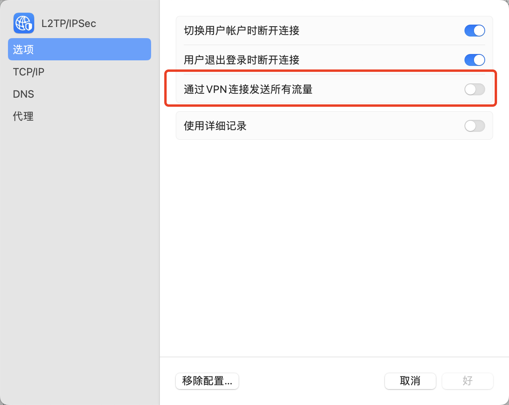

# VPN 分流（内部服务才走 VPN）

## 1、问题

经常在家办公，不连接 vpn 无法访问 git 仓库等服务。连接 vpn，其他流量都要到公司网络转一圈，速度很慢。

## 2、解决方法

VPN 分流

### 2.1 VPN 配置关闭“通过 VPN 连接发送所有流量”


系统 macOS 13 界面 界面配置

### 2.2 查询需要访问的内部服务 ip

```sh
➜  ~ nslookup github.com
Server:		8.8.8.8
Address:	8.8.8.8#53

Non-authoritative answer:
Name:	github.com
Address: 20.205.243.166
```

### 2.3 添加配置文件

添加文件 `sudo vi /etc/ppp/ip-up`，添加如下内容：

```sh
#!/bin/sh
/sbin/route add -net 20.205.243.166/32 -interface ppp0
```

保存退出赋权限`sudo chmod 0755 /etc/ppp/ip-up`

断开 VPN 重新连接。这样`内部服务`的流量就走 vpn，其他走本地

## 3、一键脚本

复制到命令行运行：

```sh
sudo touch /etc/ppp/ip-up
sudo chmod 0777 /etc/ppp/ip-up
sudo cat>/etc/ppp/ip-up<<EOF
#!/bin/sh
/sbin/route add -net 20.205.243.166/32 -interface ppp0
EOF
sudo chmod 0755 /etc/ppp/ip-up
```

断开 VPN 重新连接后生效
